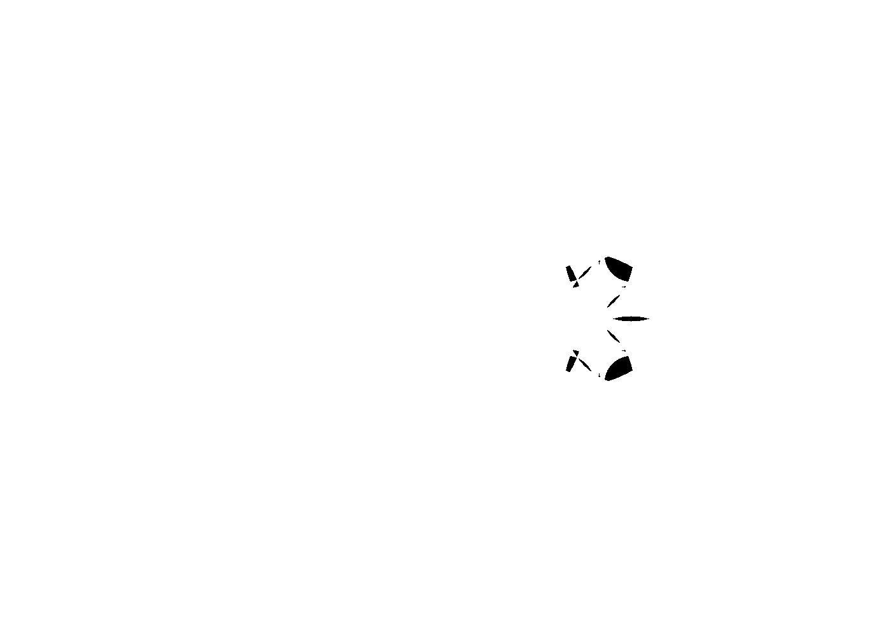

# runtime_joy

[Back to gallery](index.md)

## Summary

- Input text: `joy`
- Frame count: `41`
- Level count: `10`

## Preview

## Files

- [effective_config.yaml](../output/runtime_joy/effective_config.yaml)
- [circles.yaml](../output/runtime_joy/circles.yaml)
- [final image](../output/runtime_joy/working.png)
- [animation](../output/runtime_joy/working.gif)

## Level Previews

