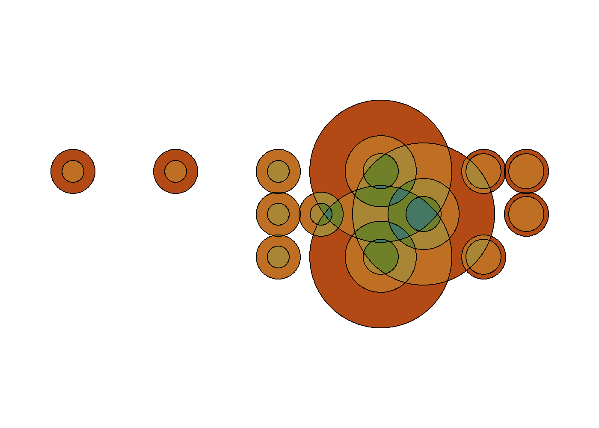
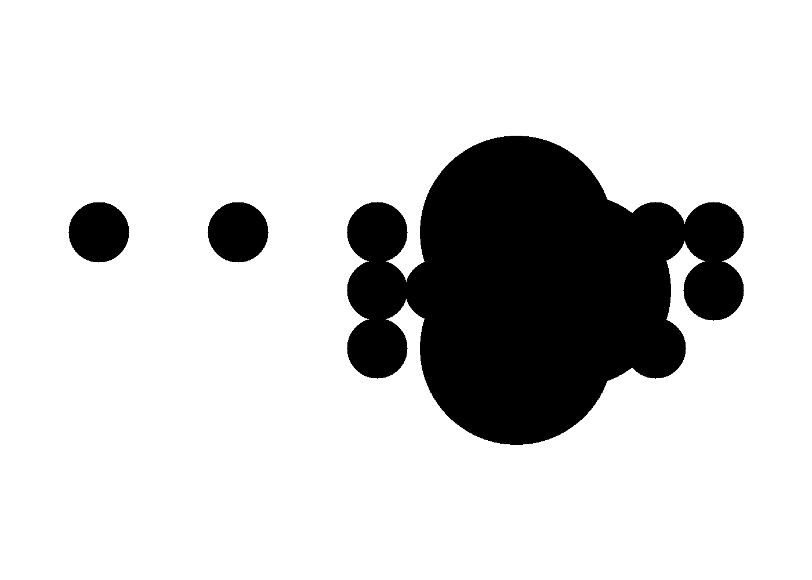
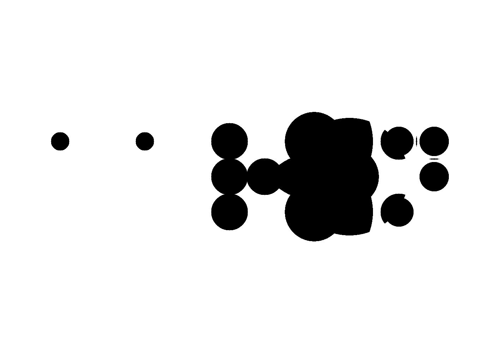
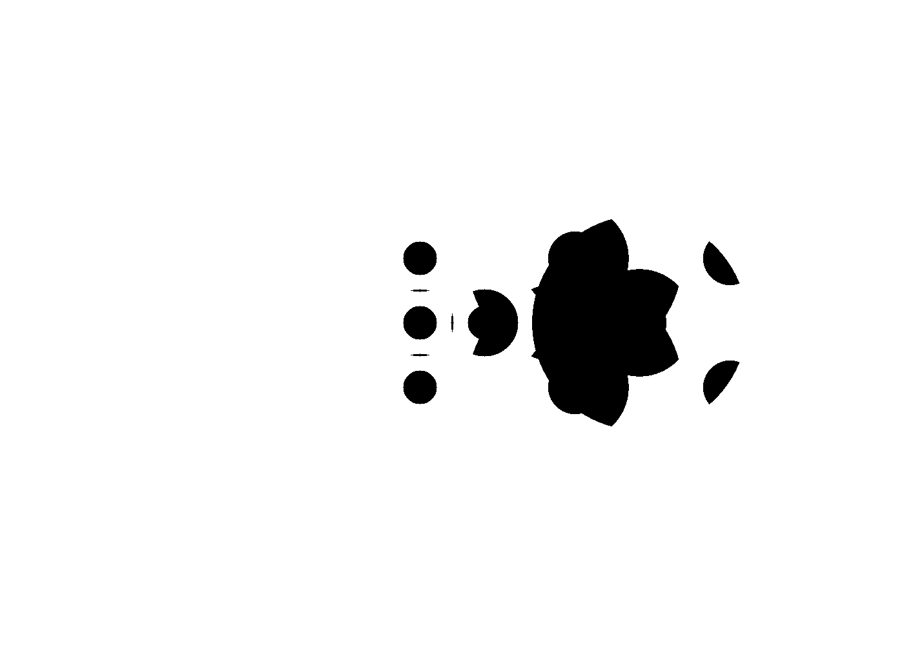
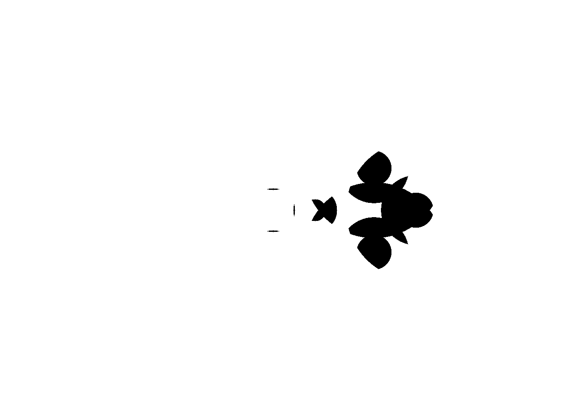
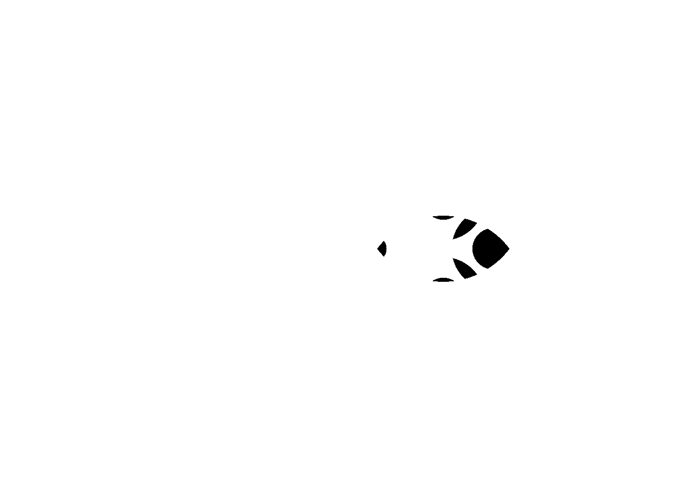

# runtime_joy

[Back to output gallery](../README.md)

## Summary

- Input text: `aaron`
- Frame count: `41`
- Level count: `5`

## Preview

## Files

- [effective_config.yaml](./effective_config.yaml)
- [circles.yaml](./circles.yaml)
- [final image](./working.png)
- [animation](./working.gif)

## Level Previews

