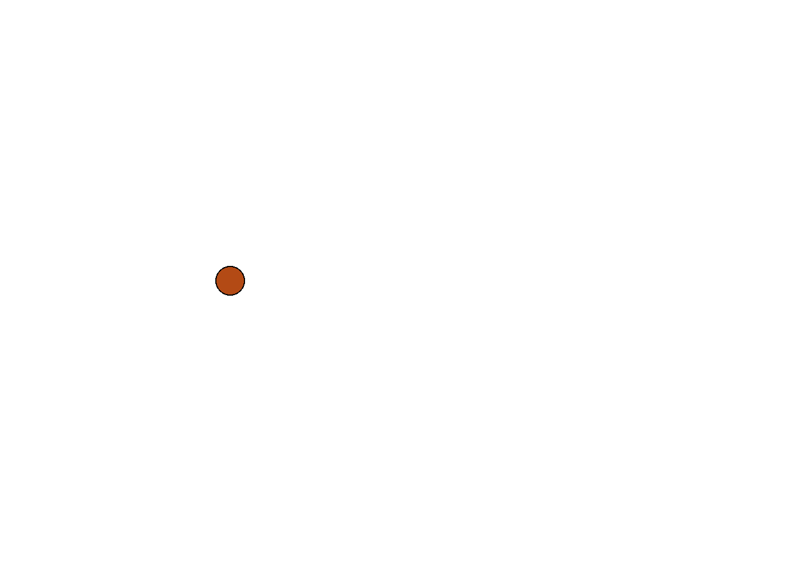
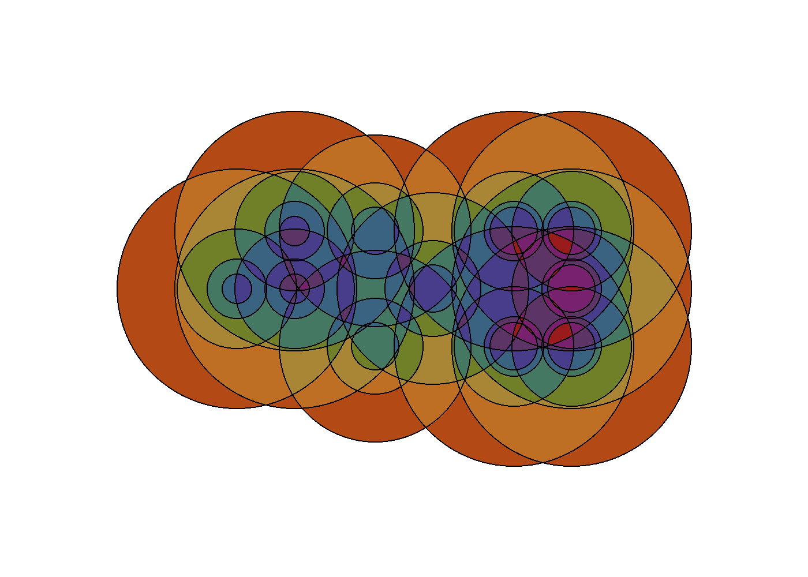

# Circle Overlap Generation

This project turns a word into a layered circle composition by combining two data systems at once:

- a Braille-style dot grid decides where circles can appear
- a Morse-style sequence decides how each active dot grows across repeated circles

The current runtime is config-driven, prompts for the word on launch, renders a final image, renders frame-by-frame build images, builds an animated GIF, and opens the generated result in your browser.

## Preview

### Animated Output



### Final Render



## How It Works

The rendering pipeline is intentionally simple.

1. [main.py](main.py) loads the config, asks for a word, runs generation, writes images, builds animation output, and opens the preview.
2. [config.py](config.py) loads the runtime YAML and the external data files for alphabet mappings, geometry, and palettes.
3. [generator.py](generator.py) converts the input word into circles.
4. [rendering.py](rendering.py) computes overlap counts, paints color bands, writes mask levels, and builds the GIF from the frame sequence.

### The design rule

For each letter:

- the Braille pattern decides which cells in the letter grid are active
- each active cell gets a stack of circles at the same center
- the Morse pattern decides how many circles to create and how the radius grows from one circle to the next

That means the word is encoded both spatially and rhythmically.

## Project Structure

```text
configuration/
  runtime.yaml
  alphabets.yaml
  geometry.yaml
  palettes.yaml
main.py
config.py
generator.py
rendering.py
preview_3d.py
generate_navigation.py
output/
```

## Running It

From the repository root:

```powershell
C:/Users/aaron/AppData/Local/Programs/Python/Python312/python.exe main.py
```

Or use the included helper scripts:

```powershell
setup.bat
start.bat
```

```bash
./setup.sh
./start.sh
```

For the first 3D viewer pass:

```powershell
start_3d.bat
```

```bash
./start_3d.sh
```

You will be prompted like this:

```text
Word to generate:
```

After you enter a supported word, the program will:

1. generate the circle layout
2. render the final PNG
3. render the progressive frame sequence
4. build a GIF animation
5. open the generated preview in your default browser

The `start` scripts then run the navigation generator so the output gallery pages stay current.

## Setup Scripts

The repo includes simple cross-platform setup scripts.

- [setup.bat](setup.bat) creates `.venv` on Windows and installs the dependencies from [requirements.txt](requirements.txt)
- [setup.sh](setup.sh) does the same on macOS or Linux

## Start Scripts

- [start.bat](start.bat) launches the prompt-driven generator on Windows and then refreshes the output gallery
- [start.sh](start.sh) does the same on macOS or Linux

## Example Output Folder

The current default run writes to a word-specific folder such as [output/joy](output/joy).

That folder contains:

- `working.png` for the final still image
- `working.gif` for the animation
- `working_0.png` through `working_n.png` for progressive build frames
- `working/level_1.png` through `working/level_n.png` for overlap masks
- `circles.yaml` for the generated circle list
- `effective_config.yaml` for the exact config used during the run

## Configuration Files

### Runtime

[configuration/runtime.yaml](configuration/runtime.yaml) controls the active run.

```yaml
input:
  text: joy

outputs:
  directory: ../output
  final_filename: working.png
  sequence:
    enabled: true
  animation:
    enabled: true
    filename: working.gif
```

At runtime, the prompt value overrides `input.text`.

### Alphabets

[configuration/alphabets.yaml](configuration/alphabets.yaml) contains the Braille and Morse mappings used to translate letters into geometry.

### Geometry

[configuration/geometry.yaml](configuration/geometry.yaml) contains the layout numbers such as starting offsets, spacing, diameter, and growth multipliers.

### Palettes

[configuration/palettes.yaml](configuration/palettes.yaml) contains the color sets used by the overlap renderer.

## Browsing Generated Work

The repo includes a gallery generator script that writes markdown navigation pages from the contents of `output/`.

Run it like this:

```powershell
C:/Users/aaron/AppData/Local/Programs/Python/Python312/python.exe generate_navigation.py
```

That writes browsable markdown pages directly into [output](output), including:

- [output/README.md](output/README.md) for the gallery home page
- one [README.md](output/joy/README.md) inside each generated output folder

## Example Gallery

Once generated, the gallery can be browsed starting from [output/README.md](output/README.md).

## Viewing The 3D Version

The current first-pass 3D viewer reads the exported [scene_3d.json](output/joy/scene_3d.json) file and builds a lit `PyVista` scene from the layered discs.

Run it directly:

```powershell
python preview_3d.py --word joy
```

Or use the helper launcher:

```powershell
start_3d.bat
```

The viewer will:

1. load `output/<word>/scene_3d.json`
2. build thin cylinders for each disc
3. place them in depth using the exported `z` positions
4. open an interactive 3D window
5. save a snapshot as `output/<word>/preview_3d.png`

If you want an off-screen snapshot only:

```powershell
python preview_3d.py --word joy --no-show
```

## Notes

- The current supported alphabet is the one defined in [configuration/alphabets.yaml](configuration/alphabets.yaml). Unsupported letters fail fast during config validation.
- The old prototype remains in [old/working.py](old/working.py) as a reference implementation.
- The current generated sample in the repo is based on the word `joy`, which now writes into `output/joy` by default.